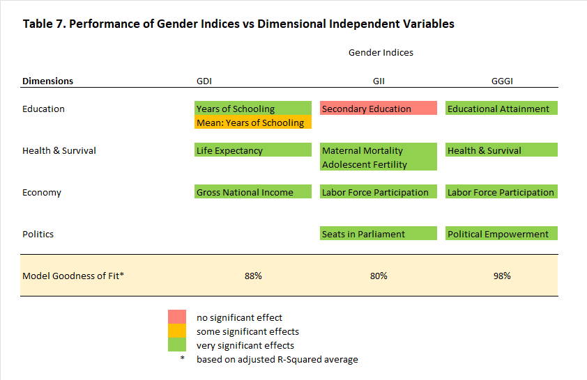
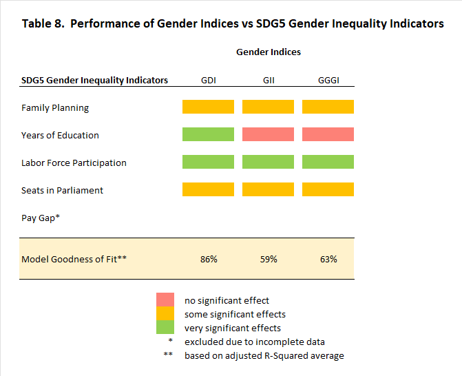

```{r setup, echo=FALSE}

# Check required packages
required_packages <-  c("dplyr", "tidyverse", "ggplot2", "echarts4r", "plm", "lmtest", "rmarkdown", "GGally", "stargazer", "kableExtra", "tinytex", "flexdashboard", "highcharter", "gt", "htmltools", "viridis", "knitr")
need_install <- required_packages[!(required_packages) %in% installed.packages()]
if (length(need_install) > 0) {
  install.packages(need_install)}

# load required packages
lapply(required_packages, require, character.only = TRUE)

# Set working directory
dir_script <- getwd() #dirname(rstudioapi::getSourceEditorContext()$path)
setwd(dir_script)

```


```{r import, echo=FALSE}
# Importing data
# 1. ofw destinations
ofw_dest <- read.csv("analytix_ofw_dest.csv",TRUE,",")
colnames(ofw_dest) <- c("Rank", "Country", "Male", "Female", "OFW")

# 2. gender indices data
gender <- read.csv("analytix_gender_index.csv",TRUE,",")
# create a backup of original table
gender2 <- gender
# change year to type factor for graphing
gender$year <- as.factor(gender$year)
# create panel data frame
gender_df <- pdata.frame(read.csv("analytix_gender_index.csv",TRUE,","),index=c("rank","year"))

# Split gender indices per country

# 1. Philippines
mgi_PH <- gender
mgi_PH <- mgi_PH[c(7:20),c("country_name", "year", "gdi", "gii", "gggi")]
colnames(mgi_PH) <- c("Country", "Year", "GDI", "GII", "GGGI")

# 2. Saudi Arabia
mgi_SA <- gender
mgi_SA <- mgi_SA[c(27:40),c("country_name", "year", "gdi", "gii", "gggi")]
colnames(mgi_SA) <- c("Country", "Year", "GDI", "GII", "GGGI")

# 3. United Arab Emirates
mgi_AE <- gender
mgi_AE <- mgi_AE[c(47:60),c("country_name", "year", "gdi", "gii", "gggi")]
colnames(mgi_AE) <- c("Country", "Year", "GDI", "GII", "GGGI")

# 4. Kuwait
mgi_KW <- gender
mgi_KW <- mgi_KW[c(67:80),c("country_name", "year", "gdi", "gii", "gggi")]
colnames(mgi_KW) <- c("Country", "Year", "GDI", "GII", "GGGI")

# 5. Qatar
mgi_QA <- gender
mgi_QA <- mgi_QA[c(87:100),c("country_name", "year", "gdi", "gii", "gggi")]
colnames(mgi_QA) <- c("Country", "Year", "GDI", "GII", "GGGI")

# 6. Singapore
mgi_SG <- gender
mgi_SG <- mgi_SG[c(107:120),c("country_name", "year", "gdi", "gii", "gggi")]
colnames(mgi_SG) <- c("Country", "Year", "GDI", "GII", "GGGI")

# 7. Japan
mgi_JP <- gender
mgi_JP <- mgi_JP[c(127:140),c("country_name", "year", "gdi", "gii", "gggi")]
colnames(mgi_JP) <- c("Country", "Year", "GDI", "GII", "GGGI")

# 8. Australia
mgi_AU <- gender
mgi_AU <-mgi_AU[c(147:160),c("country_name", "year", "gdi", "gii", "gggi")]
colnames(mgi_AU) <- c("Country", "Year", "GDI", "GII", "GGGI")

# 9. Malaysia
mgi_MY <- gender
mgi_MY <-mgi_MY[c(167:180),c("country_name", "year", "gdi", "gii", "gggi")]
colnames(mgi_MY) <- c("Country", "Year", "GDI", "GII", "GGGI")

```

OFW Leading Destination Countries
=======================================================================

Row {.tabset data-width=500}
-----------------------------------------------------------------------

### OFW Destination Countries

```{r ofw_dest1, echo=FALSE}
# Colors
custom_colors <- viridis::mako(n=11)

# Pie chart
ofw_dest |>
  hchart('pie', hcaes(x=Country, y=OFW, color=custom_colors)) |>
  hc_add_theme(hc_theme_google()) |>
  hc_tooltip(pointFormat='<b>Proportion: </b> {point.percentage:,.2f}%') |>
  hc_title(text='Top 10 OFW Destination Countries', style=list(fontSize='15px', fontWeight='bold'), align="left")|>
  hc_credits(enabled=TRUE, text='data source: Philippine Statistics Authority. 2020 OFW estimates.')
```

Row {data-width=500}
-----------------------------------------------------------------------

### Gender distribution in Destination Countries

```{r ofw_dest2, echo=FALSE}
ofw_p <- ofw_dest |>
  e_charts(Country, time_line=FALSE, reorder=TRUE) |>
  e_bar(Male, color="green", stack = "grp") |>
  e_bar(Female, color="orange", stack = "grp") |>   
  e_title("Gender distribution in Destination Countries", align="left") |>
  e_grid(left = '17%') |>
  e_legend(orient='vertical', right='5',top='15%')
e_flip_coords(ofw_p)
```   

Philippines {data-navmenu="Gender Inequality Measures"} 
=======================================================================

Column {.tabset data-width=500}
-----------------------------------------------------------------------

### Philippines 

```{r gender_msr_PH, echo=FALSE}

mgi_PH |>
  e_charts(x = Year) |>
  e_line(serie = GDI) |>
  e_line(serie = GII) |>
  e_line(serie = GGGI) |>
  e_grid(right = '20%') |>
  e_legend(orient='vertical', right='5',top='15%') |>
  e_title("Gender Inequality Measures", align="left")
```

Row {.tabset}
-----------------------------------------------------------------------

```{r corr_PH, echo=FALSE}

ggpairs(data=mgi_PH, columns=3:5, 
        aes(color="Country", alpha=0.5), title="Gender Indices Correlation Matrix" )
```  

Saudi Arabia {data-navmenu="Gender Inequality Measures"} 
=======================================================================

Column {.tabset .tabset-fade data-width=500}
-----------------------------------------------------------------------

### Saudi Arabia 

```{r gender_msr_SA, echo=FALSE}

mgi_SA |>
  e_charts(x = Year) |>
  e_line(serie = GDI) |>
  e_line(serie = GII) |>
  e_line(serie = GGGI) |>
  e_grid(right = '20%') |>
  e_legend(orient='vertical', right='5',top='15%') |>
  e_title("Gender Inequality Measures", align="left")
```

Row {.tabset .tabset-fade data-width=500}
-----------------------------------------------------------------------

```{r corr_SA, echo=FALSE}

ggpairs(data=mgi_SA, columns=3:5, 
        aes(color="Country", alpha=0.5), title="Gender Indices Correlation Matrix" )
```  

United Arab Emirates {data-navmenu="Gender Inequality Measures"} 
=======================================================================

Column {.tabset .tabset-fade data-width=500}
-----------------------------------------------------------------------

### United Arab Emirates 

```{r gender_msr_AE, echo=FALSE}

mgi_AE |>
  e_charts(x = Year) |>
  e_line(serie = GDI) |>
  e_line(serie = GII) |>
  e_line(serie = GGGI) |>
  e_grid(right = '20%') |>
  e_legend(orient='vertical', right='5',top='15%') |>
  e_title("Gender Inequality Measures", align="left")
```

Row {.tabset .tabset-fade data-width=500}
-----------------------------------------------------------------------

```{r corr_AE, echo=FALSE}

ggpairs(data=mgi_AE, columns=3:5, 
        aes(color="Country", alpha=0.5), title="Gender Indices Correlation Matrix" )
```  

Kuwait {data-navmenu="Gender Inequality Measures"} 
=======================================================================

Column {.tabset .tabset-fade data-width=500}
-----------------------------------------------------------------------

### Kuwait 

```{r gender_msr_KW, echo=FALSE}

mgi_KW |>
  e_charts(x = Year) |>
  e_line(serie = GDI) |>
  e_line(serie = GII) |>
  e_line(serie = GGGI) |>
  e_grid(right = '20%') |>
  e_legend(orient='vertical', right='5',top='15%') |>
  e_title("Gender Inequality Measures", align="left")
```

Row {.tabset .tabset-fade data-width=500}
-----------------------------------------------------------------------

```{r corr_KW, echo=FALSE}

ggpairs(data=mgi_KW, columns=3:5, 
        aes(color="Country", alpha=0.5), title="Gender Indices Correlation Matrix" )
```  

Qatar {data-navmenu="Gender Inequality Measures"} 
=======================================================================

Column {.tabset .tabset-fade data-width=500}
-----------------------------------------------------------------------

### Qatar 

```{r gender_msr_QA, echo=FALSE}

mgi_QA |>
  e_charts(x = Year) |>
  e_line(serie = GDI) |>
  e_line(serie = GII) |>
  e_line(serie = GGGI) |>
  e_grid(right = '20%') |>
  e_legend(orient='vertical', right='5',top='15%') |>
  e_title("Gender Inequality Measures", align="left")
```

Row {.tabset .tabset-fade data-width=500}
-----------------------------------------------------------------------

```{r corr_QA, echo=FALSE}

ggpairs(data=mgi_QA, columns=3:5, 
        aes(color="Country", alpha=0.5), title="Gender Indices Correlation Matrix" )
```  

Singapore {data-navmenu="Gender Inequality Measures"} 
=======================================================================

Column {.tabset .tabset-fade data-width=500}
-----------------------------------------------------------------------

### Singapore 

```{r gender_msr_SG, echo=FALSE}

mgi_SG |>
  e_charts(x = Year) |>
  e_line(serie = GDI) |>
  e_line(serie = GII) |>
  e_line(serie = GGGI) |>
  e_grid(right = '20%') |>
  e_legend(orient='vertical', right='5',top='15%') |>
  e_title("Gender Inequality Measures", align="left")
```

Row {.tabset .tabset-fade data-width=500}
-----------------------------------------------------------------------

```{r corr_SG, echo=FALSE}

ggpairs(data=mgi_SG, columns=3:5, 
        aes(color="Country", alpha=0.5), title="Gender Indices Correlation Matrix" )
```  

Japan {data-navmenu="Gender Inequality Measures"} 
=======================================================================

Column {.tabset .tabset-fade data-width=500}
-----------------------------------------------------------------------

### Japan 

```{r gender_msr_JP, echo=FALSE}

mgi_JP |>
  e_charts(x = Year) |>
  e_line(serie = GDI) |>
  e_line(serie = GII) |>
  e_line(serie = GGGI) |>
  e_grid(right = '20%') |>
  e_legend(orient='vertical', right='5',top='15%') |>
  e_title("Gender Inequality Measures", align="left")
```

Row {.tabset .tabset-fade data-width=500}
-----------------------------------------------------------------------

```{r corr_JP, echo=FALSE}

ggpairs(data=mgi_JP, columns=3:5, 
        aes(color="Country", alpha=0.5), title="Gender Indices Correlation Matrix" )
```  

Australia {data-navmenu="Gender Inequality Measures"} 
=======================================================================

Column {.tabset .tabset-fade data-width=500}
-----------------------------------------------------------------------

### Australia 

```{r gender_msr_AU, echo=FALSE}

mgi_AU |>
  e_charts(x = Year) |>
  e_line(serie = GDI) |>
  e_line(serie = GII) |>
  e_line(serie = GGGI) |>
  e_grid(right = '20%') |>
  e_legend(orient='vertical', right='5',top='15%') |>
  e_title("Gender Inequality Measures", align="left")
```

Row {.tabset .tabset-fade data-width=500}
-----------------------------------------------------------------------

```{r corr_AU, echo=FALSE}

ggpairs(data=mgi_AU, columns=3:5, 
        aes(color="Country", alpha=0.5), title="Gender Indices Correlation Matrix" )
```  

Malaysia {data-navmenu="Gender Inequality Measures"} 
=======================================================================

Column {.tabset .tabset-fade data-width=500}
-----------------------------------------------------------------------

### Malaysia 

```{r gender_msr_MY, echo=FALSE}

mgi_MY |>
  e_charts(x = Year) |>
  e_line(serie = GDI) |>
  e_line(serie = GII) |>
  e_line(serie = GGGI) |>
  e_grid(right = '20%') |>
  e_legend(orient='vertical', right='5',top='15%') |>
  e_title("Gender Inequality Measures", align="left")
```

Row {.tabset .tabset-fade data-width=500}
-----------------------------------------------------------------------

```{r corr_MY, echo=FALSE}

ggpairs(data=mgi_MY, columns=3:5, 
        aes(color="Country", alpha=0.5), title="Gender Indices Correlation Matrix" )
```  


```{r instr}
#Panel reg starts here
```


GDI by dim.index (HDI) {data-navmenu="Panel Regression Results"} 
=======================================================================

Column {.tabset .tabset-fade data-width=500}
-----------------------------------------------------------------------

### GDI by dimensional index (HDI) 
```{r gdi_dim_ndx, echo=FALSE}
gdi_po <- plm(log(gdi)~hdi_f+hdi_m, data=gender_df[which(!is.na(gender_df$gdi)),], model = "pooling")
gdi_fe <- plm(log(gdi)~hdi_f+hdi_m, data=gender_df[which(!is.na(gender_df$gdi)),], model = "within")
gdi_re <- plm(log(gdi)~hdi_f+hdi_m, data=gender_df[which(!is.na(gender_df$gdi)),], model = "random")

stargazer(gdi_po, gdi_fe, gdi_re, align=TRUE, type="text",
          title="Panel Regression Models (GDI)",
          column.labels = c("Pooled", "Fixed Effects", "Random Effects"),
          covariate.labels = c("HD Female", "HD Male"), 
          dep.var.caption = "Gender Development Index",
          out="preg_gdi.txt")
```

GDI by indicator: female {data-navmenu="Panel Regression Results"} 
=======================================================================

Column {.tabset .tabset-fade data-width=500}
-----------------------------------------------------------------------

### GDI by indicator variables for Female 
```{r gdi_indic_f, echo=FALSE}
gdi_po_f <- plm(log(gdi)~le_f+eys_f+mys_f+gni_pc_f, data=gender_df[which(!is.na(gender_df$gdi)),], model = "pooling")
gdi_fe_f <- plm(log(gdi)~le_f+eys_f+mys_f+gni_pc_f, data=gender_df[which(!is.na(gender_df$gdi)),], model = "within")
gdi_re_f <- plm(log(gdi)~le_f+eys_f+mys_f+gni_pc_f, data=gender_df[which(!is.na(gender_df$gdi)),], model = "random")

stargazer(gdi_po_f, gdi_fe_f, gdi_re_f, align=TRUE, type="text",
          title="Panel Regression Models (GDI)",
          column.labels = c("Pooled", "Fixed Effects", "Random Effects"),
          covariate.labels = c("Life Expectancy (F)","Years of Schooling (F)", "Mean: Years of Schooling (F)", "Gross National Income (F)"), 
          dep.var.caption = "Gender Development Index",
          out="preg_gdi_f.txt")
```

GDI by indicator: male {data-navmenu="Panel Regression Results"} 
=======================================================================

Column {.tabset .tabset-fade data-width=500}
-----------------------------------------------------------------------

### GDI by indicator variables for Male 
```{r gdi_indic_m, echo=FALSE}
gdi_po_m <- plm(log(gdi)~le_m+eys_m+mys_m+gni_pc_m, data=gender_df[which(!is.na(gender_df$gdi)),], model = "pooling")
gdi_fe_m <- plm(log(gdi)~le_m+eys_m+mys_m+gni_pc_m, data=gender_df[which(!is.na(gender_df$gdi)),], model = "within")
gdi_re_m <- plm(log(gdi)~le_m+eys_m+mys_m+gni_pc_m, data=gender_df[which(!is.na(gender_df$gdi)),], model = "random")

stargazer(gdi_po_m, gdi_fe_m, gdi_re_m, align=TRUE, type="text",
          title="Panel Regression Models (GDI)",
          column.labels = c("Pooled", "Fixed Effects", "Random Effects"),
          covariate.labels = c("Life Expectancy (M)","Years of Schooling (M)", "Mean: Years of Schooling (M)", "Gross National Income (M)"), 
          dep.var.caption = "Gender Development Index",
          out="preg_gdi_m.txt")
```

GII by indicator var {data-navmenu="Panel Regression Results"} 
=======================================================================

Column {.tabset .tabset-fade data-width=500}
-----------------------------------------------------------------------

### GII by indicator variables 
```{r gii_indic, echo=FALSE}
gii_po <- plm(log(gii)~sdg3_matmort+sdg3_fertility+sdg5_parl+sdg4_second+sdg5_lfpr, data=gender_df[which(!is.na(gender_df$gii)),], model = "pooling")
gii_fe <- plm(log(gii)~sdg3_matmort+sdg3_fertility+sdg5_parl+sdg4_second+sdg5_lfpr, data=gender_df[which(!is.na(gender_df$gii)),], model = "within")
gii_re <- plm(log(gii)~sdg3_matmort+sdg3_fertility+sdg5_parl+sdg4_second+sdg5_lfpr, data=gender_df[which(!is.na(gender_df$gii)),], model = "random")

stargazer(gii_po, gii_fe, gii_re, align=TRUE, type="text",
          title="Panel Regression Models (GII)",
          column.labels = c("Pooled", "Fixed Effects", "Random Effects"),
          covariate.labels = c("Maternal Mortality", "Adolescent Fertility","Seats in Parliament","Secondary Education","Labor Force Participation"), 
          dep.var.caption = "Gender Inequality Index",
          out="preg_gii.txt")
```

GGGI by sub.index vars {data-navmenu="Panel Regression Results"} 
=======================================================================

Column {.tabset .tabset-fade data-width=500}
-----------------------------------------------------------------------

### GGGI by sub.index variables 
```{r gggi_ndx, echo=FALSE}
gggi_po <- plm(log(gggi)~ggg_pe+ggg_epo+ggg_ea+ggg_hs, data=gender_df[which(!is.na(gender_df$gggi)),], model = "pooling")
gggi_fe <- plm(log(gggi)~ggg_pe+ggg_epo+ggg_ea+ggg_hs, data=gender_df[which(!is.na(gender_df$gggi)),], model = "within")
gggi_re <- plm(log(gggi)~ggg_pe+ggg_epo+ggg_ea+ggg_hs, data=gender_df[which(!is.na(gender_df$gggi)),], model = "random")

stargazer(gggi_po, gggi_fe, gggi_re, align=TRUE, type="text",
          title="Panel Regression Models (GGGI)",
          column.labels = c("Pooled", "Fixed Effects", "Random Effects"),
          covariate.labels = c("Political Empowerment", "Economic Participation","Educational Attainment","Health Survival"), 
          dep.var.caption = "Global Gender Gap Index",
          out="preg_gggi.txt")
```

GDI by SDG5 vars {data-navmenu="Panel Regression Results"} 
=======================================================================

Column {.tabset .tabset-fade data-width=500}
-----------------------------------------------------------------------

### GDI by SDG5 variables
```{r gdi_sdg, echo=FALSE}
gdi_sdg_po <- plm(log(gdi)~sdg5_fplmodel+sdg5_edat+sdg5_lfpr+sdg5_parl, data=gender_df[which(!is.na(gender_df$gdi)),], model = "pooling")
gdi_sdg_fe <- plm(log(gdi)~sdg5_fplmodel+sdg5_edat+sdg5_lfpr+sdg5_parl, data=gender_df[which(!is.na(gender_df$gdi)),], model = "within")
gdi_sdg_re <- plm(log(gdi)~sdg5_fplmodel+sdg5_edat+sdg5_lfpr+sdg5_parl, data=gender_df[which(!is.na(gender_df$gdi)),], model = "random")

stargazer(gdi_sdg_po, gdi_sdg_fe, gdi_sdg_re, align=TRUE, type="text",
          title="Panel Regression Models (GDI with SDG gender inequality indicators)",
          column.labels = c("Pooled", "Fixed Effects", "Random Effects"),
          covariate.labels = c("Family Planning", "Years of Education", "Labor Force Participation", "Seats in Parliament"), 
          dep.var.caption = "Gender Development Index",
          out="preg_gdi_sdg.txt")
```

GII by SDG5 vars {data-navmenu="Panel Regression Results"} 
=======================================================================

Column {.tabset .tabset-fade data-width=500}
-----------------------------------------------------------------------

### GII by SDG5 variables
```{r gii_sdg, echo=FALSE}
gii_sdg_po <- plm(log(gii)~sdg5_fplmodel+sdg5_edat+sdg5_lfpr+sdg5_parl, data=gender_df[which(!is.na(gender_df$gii)),], model = "pooling")
gii_sdg_fe <- plm(log(gii)~sdg5_fplmodel+sdg5_edat+sdg5_lfpr+sdg5_parl, data=gender_df[which(!is.na(gender_df$gii)),], model = "within")
gii_sdg_re <- plm(log(gii)~sdg5_fplmodel+sdg5_edat+sdg5_lfpr+sdg5_parl, data=gender_df[which(!is.na(gender_df$gii)),], model = "random")

stargazer(gii_sdg_po, gii_sdg_fe, gii_sdg_re, align=TRUE, type="text",
          title="Panel Regression Models (GII with SDG gender inequality indicators)",
          column.labels = c("Pooled", "Fixed Effects", "Random Effects"),
          covariate.labels = c("Family Planning", "Years of Education", "Labor Force Participation", "Seats in Parliament"), 
          dep.var.caption = "Gender Inequality Index",
          out="preg_gii_sdg.txt")
```

GGGI by SDG5 vars {data-navmenu="Panel Regression Results"} 
=======================================================================

Column {.tabset .tabset-fade data-width=500}
-----------------------------------------------------------------------

### GGGI by SDG5 variables
```{r gggi_sdg, echo=FALSE}
gggi_sdg_po <- plm(log(gggi)~sdg5_fplmodel+sdg5_edat+sdg5_lfpr+sdg5_parl, data=gender_df[which(!is.na(gender_df$gggi)),], model = "pooling")
gggi_sdg_fe <- plm(log(gggi)~sdg5_fplmodel+sdg5_edat+sdg5_lfpr+sdg5_parl, data=gender_df[which(!is.na(gender_df$gggi)),], model = "within")
gggi_sdg_re <- plm(log(gggi)~sdg5_fplmodel+sdg5_edat+sdg5_lfpr+sdg5_parl, data=gender_df[which(!is.na(gender_df$gggi)),], model = "random")

stargazer(gggi_sdg_po, gggi_sdg_fe, gggi_sdg_re, align=TRUE, type="text",
          title="Panel Regression Models (GGGI with SDG gender inequality indicators)",
          column.labels = c("Pooled", "Fixed Effects", "Random Effects"),
          covariate.labels = c("Family Planning", "Years of Education", "Labor Force Participation", "Seats in Parliament"), 
          dep.var.caption = "Global Gender Gap Index",
          out="preg_gggi_sdg.txt")
```

Summary: measures by vars {data-navmenu="Panel Regression Results"} 
=======================================================================

Column {.tabset .tabset-fade data-width=500}
-----------------------------------------------------------------------

### Summary of Gender Inequality Measures by index/indicator variables
```{r summ_div, out.width="50%",  out.height="50%", echo=FALSE}

```

Summary: measures by SDG5 {data-navmenu="Panel Regression Results"} 
=======================================================================

Column {.tabset .tabset-fade data-width=500}
-----------------------------------------------------------------------

### Summary of Gender Inequality Measures by SGD5 variables
```{r summ_sdg, out.width="50%",  out.height="50%", echo=FALSE}

```
