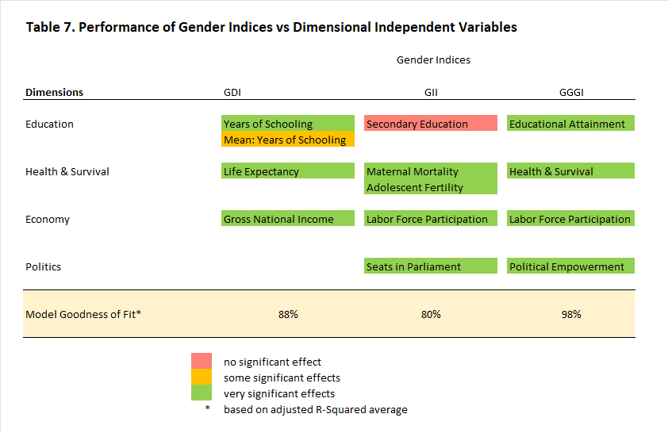

```{r packages, include=FALSE, warning=FALSE}
knitr::opts_chunk$set(echo=FALSE)

# Check required packages
required_packages <-  c("dplyr", "tidyverse", "ggplot2", "echarts4r", "plm", "lmtest", "rmarkdown", "GGally", "stargazer", "kableExtra", "tinytex")
need_install <- required_packages[!(required_packages) %in% installed.packages()]
if (length(need_install) > 0) {
  install.packages(need_install)}

# load required packages
lapply(required_packages, require, character.only = TRUE)

# Set working directory
dir_script <- getwd() #dirname(rstudioapi::getSourceEditorContext()$path)
setwd(dir_script)
```

```{r datasets, echo=FALSE, warning=FALSE}
# Load datasets
# 1. ofw destinations
ofw_dest <- read.csv("analytix_ofw_dest.csv",TRUE,",")
colnames(ofw_dest) <- c("Rank", "Country", "Male", "Female", "OFW")

# 2. gender indices data
gender <- read.csv("analytix_gender_index.csv",TRUE,",")
# create a backup of original table
gender2 <- gender
# change year to type factor for graphing
gender$year <- as.factor(gender$year)
# create panel data frame
gender_df <- pdata.frame(read.csv("analytix_gender_index.csv",TRUE,","),index=c("rank","year"))

# Split gender indices per country
# 1. Philippines
mgi_PH <- gender
mgi_PH <- mgi_PH[c(7:20),c("country_name", "year", "gdi", "gii", "gggi")]
colnames(mgi_PH) <- c("Country", "Year", "GDI", "GII", "GGGI")

# 2. Saudi Arabia
mgi_SA <- gender
mgi_SA <- mgi_SA[c(27:40),c("country_name", "year", "gdi", "gii", "gggi")]
colnames(mgi_SA) <- c("Country", "Year", "GDI", "GII", "GGGI")

# 3. United Arab Emirates
mgi_AE <- gender
mgi_AE <- mgi_AE[c(47:60),c("country_name", "year", "gdi", "gii", "gggi")]
colnames(mgi_AE) <- c("Country", "Year", "GDI", "GII", "GGGI")

# 4. Kuwait
mgi_KW <- gender
mgi_KW <- mgi_KW[c(67:80),c("country_name", "year", "gdi", "gii", "gggi")]
colnames(mgi_KW) <- c("Country", "Year", "GDI", "GII", "GGGI")

# 5. Qatar
mgi_QA <- gender
mgi_QA <- mgi_QA[c(87:100),c("country_name", "year", "gdi", "gii", "gggi")]
colnames(mgi_QA) <- c("Country", "Year", "GDI", "GII", "GGGI")

# 6. Singapore
mgi_SG <- gender
mgi_SG <- mgi_SG[c(107:120),c("country_name", "year", "gdi", "gii", "gggi")]
colnames(mgi_SG) <- c("Country", "Year", "GDI", "GII", "GGGI")

# 7. Japan
mgi_JP <- gender
mgi_JP <- mgi_JP[c(127:140),c("country_name", "year", "gdi", "gii", "gggi")]
colnames(mgi_JP) <- c("Country", "Year", "GDI", "GII", "GGGI")

# 8. Australia
mgi_AU <- gender
mgi_AU <-mgi_AU[c(147:160),c("country_name", "year", "gdi", "gii", "gggi")]
colnames(mgi_AU) <- c("Country", "Year", "GDI", "GII", "GGGI")

# 9. Malaysia
mgi_MY <- gender
mgi_MY <-mgi_MY[c(167:180),c("country_name", "year", "gdi", "gii", "gggi")]
colnames(mgi_MY) <- c("Country", "Year", "GDI", "GII", "GGGI")

```


# ***Comparative Analysis of Gender Inequality Measures applied to Leading OFW Destination Countries and the Philippines***   

### J. Norman Pasamonte and David Pasamonte   
\\  

## Introduction
\\  

The Study aims to validate determinants of gender inequality using the leading OFW destination countries and the Philippines and find trends and relationships which are linked to the theme: *“Decent work in destination countries for women”*.

Leading indicators in the form of relevant Sustainable Development Goals espoused by the United Nations are also included in the analysis.

The research will also find out which gender inequality measure is the most stable given the subset of countries under study.

The Study is under the hypothesis that the gender inequality measures covered could provide some insight into trends and dynamics of its indicator variables (or subindex) and show how each country performs.

This is a preliminary version of the research paper and is written using Rmarkdown which has simplistic and limited formatting capabilities. The final version of the paper will have the appropriate format for publishing. APA citation format is used.

---

## Gender Analysis Frameworks

\\
There are a number of gender analysis frameworks used to gather data and explain possible dependence relationships given some assumptions. March, et. al. (1999) mentions several gender frameworks and their respective tools used to gather data.  

The Harvard Analytical Framework (aka Gender Roles Framework) is among the earliest frameworks used in the field and is based on the assumption that allocating resources to women as well as men in development contributes to economic efficiency. Data is collected at the individual/household level and was found to be useful in analyzing agricultural and rural systems.  

The Moser Gender Planning Framework links women’s roles to the larger development planning process and introduces women’s “three roles” in production, reproduction and community management. Among the tools used in this framework is the WID/GAD policy matrix which evaluates how different planning approaches (welfare, equity, anti-poverty, efficiency and empowerment) have addressed the tri-roles and women’s practical and strategic needs.  

The Gender Analysis Matrix (GAM) uses a community based technique used to elicit and analyze gender differences and to challenge the subject community’s assumptions about gender. Three principles guide the use of GAM: (1) All requisite knowledge for gender analysis exists among the people whose lives are the subject of the analysis; (2) Gender analysis does not require the technical analysis of those outside the community being analyzed, except as facilitators; and (3) Gender analysis cannot be transformative unless the analysis is done by the people being analyzed.  

The Women’s Empowerment Framework (WEP) was developed by a gender expert from Zambia and uses a political argument that women’s poverty is the consequence of oppression and exploitation (rather than lack of productivity) and that in order to reduce poverty, women must be empowered. The framework proposes five progressive levels of equality: (1) control: equal control in decision-making over factors of production; (2) participation: equal participation in decision-making processes related to policy making, planning and administration; (3) conscientization: attaining equal understanding of gender roles and a gender division of labor that is fair and agreeable; (4) access: equal access to the factors of production by removing discriminatory provisions in the laws; and (5) welfare: having equal access to material welfare (food, income, medical care).  

The Social Relations Framework (SRF) is based on explicitly structural feminist roots. It extends the Moser Gender Planning Framework to a variety of institutions (households, markets, states and communities). The SRF shows how gender and other inequalities are created and reproduced within structural and institutional factors and then design policies that can enable women to work to change those factors that constrain them.

\\

## **Leading OFW Destination Countries**
Data source: [PSA] <https://openstat.psa.gov.ph/PXWeb/pxweb/en/DB/DB__3E__GD__MI/0093E3D0910.px/?rxid=d189f147-391b-4978-9f71-40858ffe04cd>

```{r ofw_dest, echo=FALSE}
slices <- c(26.03,14.60,6.42,6.34,5.43,5.42,4.76,3.50,3.41,1.49,22.10)
lbls = c('(1) Saudi Arabia','(2) United Arab Emirates','(3) Kuwait','(4) Hongkong','(5) Qatar','(6) Singapore','(7) Taiwan','(8) Japan','(9) Australia','(10) Malaysia','Rest of the World')
pie(slices, labels=lbls, main="Figure 1. Top 10 OFW Destination Countries" )
```

Saudi Arabia is the leading destination for OFWs, employing a quarter of all Filipino workers abroad. The Middle east block of Saudi Arabia, United Arab Emirates, Kuwait and Qatar, employs half of all OFWS worldwide.

---

```{r ofw_dest2, echo=FALSE, warning=FALSE}
ofw_d <- ofw_dest
ofw_p <- ofw_d |>
  e_charts(Country, time_line=TRUE) |>
  e_bar(Male, color="green", stack = "grp") |>
  e_bar(Female, color="orange", stack = "grp") |>   
  e_title("Figure 2. Gender Distribution in Leading OFW Destinations", align="center") |>
  e_grid(left = '17%') |>
  e_legend(orient='vertical', right='5',top='15%')
e_flip_coords(ofw_p)
```

Female Filipino labor migrants outnumber their male counterparts in all Arab block countries (Saudi Arabia, United Arab Emirates, Kuwait, Qatar) and even in some Asian countries (Hongkong, Singapore, Taiwan, Malaysia).

However, two countries (Hongkong and Taiwan) need be taken off the scope of Study because these countries are not listed in the database of the United Nations Development Programme (UNDP) and World Economic Forum (WEF).

Therefore, the remaining countries for analysis are:

1. Philippines
2. Saudi Arabia
3. United Arab Emirates
4. Kuwait
5. Qatar
6. Singapore
7. Taiwan
8. Japan
9. Australia
10. Malaysia

---

## **Measures of Gender Inequality**   

There are several measures of gender inequality which are in use today.

### **Gender Development Index (GDI)**     
source: [UNDP]<https://hdr.undp.org/sites/default/files/data/2020/GDI_HDR2020_040722.csv>   
\\  
The United Nations Development Program (UNDP) started the Gender Development Index (GDI) in 1995. The GDI is a composite index which adjusts the UNDP’s Human Development Index (HDI) for gender inequalities in three domains: life expectancy, education and income. 

The ratio is calculated as female HDI to male HDI. A value equal to 1 indicates development equality between genders, while values further from 1 have less development equality between genders.   

\\

#### Indicators (Independent Variables)   

\\

Figure 3. GDI Conceptual Model. source: [UNDP] <https://hdr.undp.org/sites/default/files/2021-22_HDR/hdr2021-22_technical_notes.pdf>   
```{r GDI_indicators, echo=FALSE, warning=FALSE, out.width='100%'}
knitr:: 
```
\\
Whenever data is available, indicator variables are used in modelling regression. Otherwise, it would be limited to the dimensional index.  

For GDI both indicators (life expectancy, expected years of schooling, mean years of schooling, GNI per capital) and dimensional index in the form of human development index (HDI) for males and females are used.
\\

### **Gender Empowerment Measure (GEM)**   

In the same year, UNDP launched the Gender Empowerment Measure (GEM) to measure women’s relative economic and political participation.    

Due to limitations as to the number of datapoints currently available, the Gender Empowerment Measurement (GEM) is eliminated from the scope of the Study.
\\

### **Gender Inequality Index (GII)**     
source: [UNDP]<https://hdr.undp.org/sites/default/files/data/2020/GII_HDR2020_040722.csv>
\\  
Then in 2010, UNDP introduced the Gender Inequality Index (GII) to reflect inequality in achievements between women and men in three dimensions: reproductive health, empowerment and the labor market. 

The index ranges from 0, where women and men fare equally, to 1, where one gender fares as poorly as possible in all measured dimensions. The higher the GII value, the more disparities between females and males and the more loss to human development.   

\\

#### Indicators (Independent Variables)   

\\

Figure 4. GII Conceptual Model. source: [UNDP] <https://hdr.undp.org/sites/default/files/2021-22_HDR/hdr2021-22_technical_notes.pdf>    
```{r GII_indicators, echo=FALSE, warning=FALSE, out.width='100%'}
knitr:: 
```
\\
For GII the 5 dimensional index variables (female reproductive health, female empowerment, female labor market, male empowerment, male labor market) are used due to limited data availability of indicator variables.

\\

### **Global Gender Gap Index (GGGI)**   
source: [WEF]<https://tcdata360-backend.worldbank.org/api/v1/datasets/743/dump.csv>  
\\
In 2006 the World Economic Forum (WEF) introduced the Global Gender Gap Index (GGGI) to capture the magnitude of gender-based disparities and tracking their progress over time. The GGGI examines the gap between men and women across four domains: economic participation and opportunity, educational attainment, health and survival and political empowerment.  
Scores are based on the level of access women have to resources and opportunities relative to men. Countries are given a score from 0-1. A score of 1 indicates full equality between women and men and a score of 0 indicates full inequality.  

\\

#### Indicators (Independent Variables)   

\\

Figure 5. GGGI Structure. source: [WEF] <https://www3.weforum.org/docs/WEF_GGGR_2021.pdf>   
```{r GGGI_indicators, echo=FALSE, warning=FALSE, out.width='100%'}
knitr:: 
```

\\
For GGGI the 4 subindex variables (economic participation and opportunity, educational attainment, health and survival, political empowerment) are used in the analysis. This is due to limited data availability of indicator variables.  

---

## **Gender Inequality Analysis**   

\\

### **Philippines**   

\\
For the Philippines, all gender inequality measures appear to be consistent and stable. The line graph shows slow progress toward achieving the desired gender inequality targets. 

The Human Rights Watch's report in 2018 could offer a perspective on why progress is slow. [HRW] <https://www.hrw.org/world-report/2018/country-chapters/philippines>

\\

```{r echart_ph, echo=FALSE, warning=FALSE}
mgi_PH |>
  e_charts(x = Year) |>
  e_line(serie = GDI) |>
  e_line(serie = GII) |>
  e_line(serie = GGGI) |>
  e_grid(right = '20%') |>
  e_legend(orient='vertical', right='5',top='15%') |>
  e_title("Figure 6A. Gender Measures (Philippines)", align="center")
```

In accordance with theory, relationships between gender indicators are also consistent and stable. For GDI and GGGI, 0 is gender inequality while 1 is gender equality. The inverse holds for GII where 0 is the desired state of gender equality and 1 is gender inequality. 

The correlation graphs show strong linear correlation and the negative sign denote inverse relationship between GII against both GDI and GGGI. 

\\  
```{r corr_PH, echo=FALSE, warning=FALSE}
ggpairs(data=mgi_PH, columns=3:5, 
        aes(color="Country", alpha=0.5), title="Figure 7A. Gender Indices Correlation Matrix (Philippines)" )
```
\\  

---

### **Saudi Arabia**  

\\  
For Saudi Arabia, the results are quite puzzling. While the linear graph shows that all gender inequality measures progress towards the desired gender inequality goals, there is an abrupt change starting from the year 2013 for GII. This does not seem to reflect reality.  

Prior to 2013, a new monarch, King Salman, ascended the throne in Saudi Arabia. He appointed his son Mohammed bin Salman (MBS) as crown prince and immediate heir.  

MBS instituted a number of radical reforms to streamline the government bureaucracy and address corruption. And so in 2013 saw arrests and detentions of leading figures, some of royal status, in Riyadh.  

However, Human Rights Watch report a much grimmer picture of arrests and trials of peaceful dissidents and failure to protect the rights of 9 million Saudi women and girls and 9 million foreign workers. [HRW] <https://www.hrw.org/world-report/2013/country-chapters/saudi-arabia>

\\  
```{r echart_sa, echo=FALSE, warning=FALSE}
mgi_SA |>
  e_charts(x = Year) |>
  e_line(serie = GDI) |>
  e_line(serie = GII) |>
  e_line(serie = GGGI) |>
  e_grid(right = '20%') |>
  e_legend(orient='vertical', right='5',top='15%') |>
  e_title("Figure 6B. Gender Measures (Saudi Arabia)", align="center")
```

This has also affected the correlation plots. While the relationship between GII with GGGI show high correlation and strong (inverse) linearity, the relationship between GDI with GII and GDI with GGGI is distorted with low correlation.    

\\  
```{r corr_SA, echo=FALSE, warning=FALSE}
ggpairs(data=mgi_SA, columns=3:5, 
        aes(color="Country", alpha=0.5), title="Figure 7B. Gender Indices Correlation Matrix (Saudi Arabia)" )
```
\\   

---

### **United Arab Emirates**   

\\
The case of United Arab Emirates is quite similar to Saudi Arabia. While all gender equality measures are generally moving towards desired targets of gender equality, there is a notable change from the year 2006. 
If we look at news of what transpired in 2006, we read mixed news. On the one hand, Khaleej Times, the local paper reports several comprehensive reforms in
welfare schemes for workers to address ill treatment, poor facilities and exploitation. 
source: [KT] <https://www.khaleejtimes.com/article/2006-a-remarkable-year-for-uae>

On the other hand, the Human Rights Watch report abusive conditions of migrant construction worker in the UAE, although mobility and rights of women are generally better than in Saudi Arabia. source: [HRW] <https://www.hrw.org/report/2006/11/11/building-towers-cheating-workers/exploitation-migrant-construction-workers-united>

```{r echart_ae, echo=FALSE, warning=FALSE}
mgi_AE |>
  e_charts(x = Year) |>
  e_line(serie = GDI) |>
  e_line(serie = GII) |>
  e_line(serie = GGGI) |>
  e_grid(right = '20%') |>
  e_legend(orient='vertical', right='5',top='15%') |>
  e_title("Figure 6C. Gender Measures (United Arab Emirates)", align="center")
```
   

So it is not surprising that the correlation chart shows comparable  results to that of Saudi Arabia.

While the relationship between GII with GGGI show high correlation and strong (inverse) linearity, the relationship between GDI with GII and GDI with GGGI is distorted with moderate correlation.  

```{r corr_AE, echo=FALSE, warning=FALSE}
ggpairs(data=mgi_AE, columns=3:5, 
        aes(color="Country", alpha=0.5), title="Figure 7C. Gender Indices Correlation Matrix (United Arab Emirates)" )
```
\\  

---

### **Kuwait**   

\\
For Kuwait, all gender inequality measures are generally moving towards the desired targets of gender equality. GII show volatility which could be explained by the violent political changes happening the country. The BBC news report on this political crisis where 9 governments have ruled since 2006. source: [BBC] <https://www.bbc.com/news/world-middle-east-20026581>  

The Human Rights Watch also report about the political turmoil but with minor reforms in women's rights. 
source: [HRW] <https://www.hrw.org/world-report/2013/country-chapters/kuwait>


```{r echart_kw, echo=FALSE, warning=FALSE}
mgi_KW |>
  e_charts(x = Year) |>
  e_line(serie = GDI) |>
  e_line(serie = GII) |>
  e_line(serie = GGGI) |>
  e_grid(right = '20%') |>
  e_legend(orient='vertical', right='5',top='15%') |>
  e_title("Figure 6D. Gender Measures (Kuwait)", align="center")
```

The correlation chart shows mixed and weak relationships between gender inequality measures.

While the relationship between GDI with GGGI show positive linearity its correlation is low.

The relationship between GII and both GDI and GGGI should be inverse but show positive linearity. This shows an inaccurate relationship compared to how the gender inequality measures have been designed.  

\\
```{r corr_KW, echo=FALSE, warning=FALSE}
ggpairs(data=mgi_KW, columns=3:5, 
        aes(color="Country", alpha=0.5), title="Figure 7D. Gender Indices Correlation Matrix (Kuwait)" )
```
\\

---

### **Qatar**   

\\
Qatar had not as much data as the other countries in the Arab block (Saudi Arabia, UAE, Kuwait). 

All gender inequality measures are moving towards the desired target of gender equality.

The BBC reports about the Qatari crisis where the Saudi Arabia, UAE and Bahrain severed relations with Qatar due to its links with terrorist organizations. source: [BBC] <https://www.bbc.com/news/world-middle-east-40173757>

Meanwhile the Human Rights Watch report that labor reforms failed to protect low-paid migrant workers.  [HRW] <https://www.hrw.org/world-report/2016/country-chapters/qatar>

```{r echart_qa, echo=FALSE, warning=FALSE}
mgi_QA |>
  e_charts(x = Year) |>
  e_line(serie = GDI) |>
  e_line(serie = GII) |>
  e_line(serie = GGGI) |>
  e_grid(right = '20%') |>
  e_legend(orient='vertical', right='5',top='15%') |>
  e_title("Figure 6E. Gender Measures (Qatar)", align="center")
```

The correlation chart shows mixed and relationships between gender inequality measures.

The GII show mixed relationship towards GDI and GGGI. Its (negative) relationship to GDI is correct despite low correlation. However, its (positive) relationship with GGGI is questionable and also with low correlation.

\\

```{r corr_QA, echo=FALSE, warning=FALSE}
ggpairs(data=mgi_QA, columns=3:5, 
        aes(color="Country", alpha=0.5), title="Figure 7E. Gender Indices Correlation Matrix (Qatar)" )
```

---

### **Singapore**   

\\
Singapore's gender inequality measures are comparable to the Philippines. All gender inequality measures are consistent and stable. The line graph shows progress toward achieving the desired gender inequality targets. Notable are its GII and GGGI which are at more desirable levels.

The Human Rights Watch's report in 2018 describe its draconian approach which although provides law and order but also stifles human rights. Human Rights Watch. 
[HRW] <https://www.hrw.org/world-report/2016/country-chapters/singapore>

```{r echart_sg, echo=FALSE, warning=FALSE}
mgi_SG |>
  e_charts(x = Year) |>
  e_line(serie = GDI) |>
  e_line(serie = GII) |>
  e_line(serie = GGGI) |>
  e_grid(right = '20%') |>
  e_legend(orient='vertical', right='5',top='15%') |>
  e_title("Figure 6F. Gender Measures (Singapore)", align="center")
```

All gender inequality measures align with theory with high correlation values. GII show negative linear relationship with both GDI and GGGI. Also GDI and GGGI are positively linear.

\\

```{r corr_SG, echo=FALSE, warning=FALSE}
ggpairs(data=mgi_SG, columns=3:5, 
        aes(color="Country", alpha=0.5), title="Figure 7F. Gender Indices Correlation Matrix (Singapore)" )
```

---

### **Japan**   

\\  
Japan's gender inequality measures are similar to that of Singapore. All are moving in the desired trend towards gender equality.

The Human Rights Watch's report in 2018 conveys moderate human rights issues. [HRW] <https://www.hrw.org/world-report/2018/country-chapters/japan>

\\
```{r echart_jp, echo=FALSE, warning=FALSE}
mgi_JP |>
  e_charts(x = Year) |>
  e_line(serie = GDI) |>
  e_line(serie = GII) |>
  e_line(serie = GGGI) |>
  e_grid(right = '20%') |>
  e_legend(orient='vertical', right='5',top='15%') |>
  e_title("Figure 6G. Gender Measures (Japan)", align="center")
```

All gender inequality measures align with theory and show correct relationships.

The relationship of GII with both GDI and GGGI is linear and negative, although correlation between GII and GGGI is low.

GDI show a positive linear relationship with GGGI with moderate correlation.

\\
```{r corr_JP, echo=FALSE, warning=FALSE}
ggpairs(data=mgi_JP, columns=3:5, 
        aes(color="Country", alpha=0.5), title="Figure 7G. Gender Indices Correlation Matrix (Japan)" )
```

---

### **Australia**   

\\
Australia's gender inequality measures are comparable with  Singapore and Japan. All measures are moving in the desired trend towards gender equality. 

The Human Rights Watch's report in 2018 conveys moderate human rights issues, mainly with assylum seekers and refugees. [HRW] <https://www.hrw.org/world-report/2018/country-chapters/australia>

\\
```{r echart_au, echo=FALSE, warning=FALSE}
mgi_AU |>
  e_charts(x = Year) |>
  e_line(serie = GDI) |>
  e_line(serie = GII) |>
  e_line(serie = GGGI) |>
  e_grid(right = '20%') |>
  e_legend(orient='vertical', right='5',top='15%') |>
  e_title("Figure 6H. Gender Measures (Australia)", align="center")
```

All gender inequality measures align with theory and show correct relationships.

The relationship of GII with both GDI and GGGI is linear and negative. GDI show a positive linear relationship with GGGI. All correlations were low.

\\
```{r corr_AU, echo=FALSE, warning=FALSE}
ggpairs(data=mgi_AU, columns=3:5, 
        aes(color="Country", alpha=0.5), title="Figure 7H. Gender Indices Correlation Matrix (Australia)" )
```

---

### **Malaysia**   

\\
Malaysia's gender inequality measures are comparable with the Philippines. All measures are moving in the desired trend towards gender equality. 

The Human Rights Watch's report in 2018 describes moderate human rights issues. [HRW] <https://www.hrw.org/world-report/2018/country-chapters/malaysia>


```{r echart_my, echo=FALSE, warning=FALSE}
mgi_MY |>
  e_charts(x = Year) |>
  e_line(serie = GDI) |>
  e_line(serie = GII) |>
  e_line(serie = GGGI) |>
  e_grid(right = '20%') |>
  e_legend(orient='vertical', right='5',top='15%') |>
  e_title("Figure 6I. Gender Measures (Malaysia)", align="center")
```

All gender inequality measures align with theory and show correct relationships.

The relationship of GII with both GDI and GGGI is linear and negative with high correlation. GDI show a positive linear relationship albeit with moderate correlation.

\\
```{r corr_MY, echo=FALSE, warning=FALSE}
ggpairs(data=mgi_MY, columns=3:5, 
        aes(color="Country", alpha=0.5), title="Figure 7I. Gender Indices Correlation Matrix (Malaysia)" )
```

---

## **Data Panel Regression Analysis**

Zulfikar (2018) provides a good explanation on the mechanics of panel data panel regression. Traditional parameter estimation using regression with cross sectional data is performed using ordinary least squares (OLS). Under data panel regression, the result is estimated based on best linear unbiased estimator (BLUE). 

\\

### Basic Model

The Basic Regression Model for panel data is of the form

Y~it~ = a + b~0it~ + b~1it~X~it~ + ~2it~X~2it~ + ... + b~kit~X~kit~ + e~it~
  
  where

- Y~it~ is the Dependent Variable for the i^th^ Cross-Sectional Unit and for the t^th^ Time Unit

- a is the constant

- b~kit~ is the coefficient of the k^th^ Independent Variable in the Model related to the i^th^ Cross-Sectional Unit and t^th^ Time unit.
- e~it~ is Error Term related to the i^th^ Cross-Sectional Unit and the t^th^ Time Unit

### Assumptions for Linear Models

Poole and O'Farrell (1971) provide a conscise but comprehensive discussion of all the assumptions of the linear regression model.

Among those commonly used in research include:

- **Linearity**: the relationship between X and Y variable should be linear.
- **Homoscedasticity**: the variance of the residuals should be the same for any value of X
- **Independence**: the observations are independent of each other
- **Normality**: the residuals are normally distributed

\\
However, due to time constraints some statistical tests are not carried out. In the final version of the paper, these tests will be covered. 

\\  

### Estimation Methods   

\\

#### Pooled Least Squares Method   

This is the most basic approach in panel regression models. It uses ordinary least squares (OLS) to estimate dependent variable.

\\  

#### Fixed Effects Method   

This method assumes that differences between individuals (countries in the case of this paper) can be accommodated from a different intercept. The Fixed Effect method differs from Pooled Least Squares but still uses OLS. 

\\

#### Random Effects Method   

The Random Effects approach will estimate panel data where interference variables may be interconnected between time and individuals (countries in our case). The advantage of using this approach is to eliminate heteroscedasticity and uses maximum likelihood estimation (MLE) or generalized least square (GLS) to estimate the independent variable. 

\\   

---

## Results   

\\   

### Gender Development Index   

\\

The Gender Development Index (GDI) is modeled using both its dimensional index variables and its indicator variables. Table 1 shows the panel regression results based on its dimensional index - the human development index (HDI) for females and males.

The goal of this paper to validate determinants and not forecasting. Therefore we focus on results of modeling using the three estimation methods for panel regression and not which model is the best for forecasting.

Here all models indicate that both HDI for females and males are statistically significant. The goodness of fit is high, based on adjusted R-squared. The dimensional index, HDI, for females and males are good determinants of GDI.

```{r gdi, echo=FALSE, warning=FALSE}
gdi_po <- plm(log(gdi)~hdi_f+hdi_m, data=gender_df[which(!is.na(gender_df$gdi)),], model = "pooling")
gdi_fe <- plm(log(gdi)~hdi_f+hdi_m, data=gender_df[which(!is.na(gender_df$gdi)),], model = "within")
gdi_re <- plm(log(gdi)~hdi_f+hdi_m, data=gender_df[which(!is.na(gender_df$gdi)),], model = "random")

stargazer(gdi_po, gdi_fe, gdi_re, align=TRUE, type="text",
          title="Table 1. Panel Regression Models (GDI)",
          column.labels = c("Pooled", "Fixed Effects", "Random Effects"),
          covariate.labels = c("HD Female", "HD Male"), 
          dep.var.caption = "Gender Development Index",
          out="preg_gdi.txt")
```
\\   

Next we use indicator variables to model GDI. Table 1A shows the results for females which Table 1B for males.  

Table 1A shows that all four indicator variables (life expectancy, years of schooling, mean years of schooling, gross national income) are statistically significant although goodness of fit is low to moderate. This means that life expectancy, years of schooling, mean years of schooling, gross national income for females are good determinants for GDI.

```{r gdi_f, echo=FALSE, warning=FALSE}
gdi_po_f <- plm(log(gdi)~le_f+eys_f+mys_f+gni_pc_f, data=gender_df[which(!is.na(gender_df$gdi)),], model = "pooling")
gdi_fe_f <- plm(log(gdi)~le_f+eys_f+mys_f+gni_pc_f, data=gender_df[which(!is.na(gender_df$gdi)),], model = "within")
gdi_re_f <- plm(log(gdi)~le_f+eys_f+mys_f+gni_pc_f, data=gender_df[which(!is.na(gender_df$gdi)),], model = "random")

stargazer(gdi_po_f, gdi_fe_f, gdi_re_f, align=TRUE, type="text",
          title="Table 1A. Panel Regression Models (GDI)",
          column.labels = c("Pooled", "Fixed Effects", "Random Effects"),
          covariate.labels = c("Life Expectancy (F)","Years of Schooling (F)", "Mean: Years of Schooling (F)", "Gross National Income (F)"), 
          dep.var.caption = "Gender Development Index",
          out="preg_gdi_f.txt")
```

\\  
Table 1B which measures the same indicator variables for males show different results. 

Only one model (Pooled) show statistical significance with all indicator variables. The fixed effect and random effects models show that the mean years of schooling as not significant.

Therefore, for males only life expectancy, years of schooling and gross national income are good determinants of GDI.

```{r gdi_m, echo=FALSE, warning=FALSE}
gdi_po_m <- plm(log(gdi)~le_m+eys_m+mys_m+gni_pc_m, data=gender_df[which(!is.na(gender_df$gdi)),], model = "pooling")
gdi_fe_m <- plm(log(gdi)~le_m+eys_m+mys_m+gni_pc_m, data=gender_df[which(!is.na(gender_df$gdi)),], model = "within")
gdi_re_m <- plm(log(gdi)~le_m+eys_m+mys_m+gni_pc_m, data=gender_df[which(!is.na(gender_df$gdi)),], model = "random")

stargazer(gdi_po_m, gdi_fe_m, gdi_re_m, align=TRUE, type="text",
          title="Table 1B. Panel Regression Models (GDI)",
          column.labels = c("Pooled", "Fixed Effects", "Random Effects"),
          covariate.labels = c("Life Expectancy (M)","Years of Schooling (M)", "Mean: Years of Schooling (M)", "Gross National Income (M)"), 
          dep.var.caption = "Gender Development Index",
          out="preg_gdi_m.txt")
```

---

### Gender Inequality Index  

\\
The Gender Inequality Index (GII) is modeled using its five indicator variables which are also the same variables used in some of the UN sustainable development goals (SDG).

The indicator varibles include maternal mortality (SDG3), adolescent fertility (SDG3), secondary education (SDG4), seats in parliament (SDG5) and labor force participation (SDG5). 

Table 3 show consistent significant results for all indicator variables except for secondary education. All three panel regression models show high goodness of fit.

Therefore the indicator variables maternal mortality, adolescent fertility, seats in parliament and labor force participant are good determinants of GII.

```{r gii, echo=FALSE, warning=FALSE}
gii_po <- plm(log(gii)~sdg3_matmort+sdg3_fertility+sdg5_parl+sdg4_second+sdg5_lfpr, data=gender_df[which(!is.na(gender_df$gii)),], model = "pooling")
gii_fe <- plm(log(gii)~sdg3_matmort+sdg3_fertility+sdg5_parl+sdg4_second+sdg5_lfpr, data=gender_df[which(!is.na(gender_df$gii)),], model = "within")
gii_re <- plm(log(gii)~sdg3_matmort+sdg3_fertility+sdg5_parl+sdg4_second+sdg5_lfpr, data=gender_df[which(!is.na(gender_df$gii)),], model = "random")

stargazer(gii_po, gii_fe, gii_re, align=TRUE, type="text",
          title="Table 2. Panel Regression Models (GII)",
          column.labels = c("Pooled", "Fixed Effects", "Random Effects"),
          covariate.labels = c("Maternal Mortality", "Adolescent Fertility","Seats in Parliament","Secondary Education","Labor Force Participation"), 
          dep.var.caption = "Gender Inequality Index",
          out="preg_gii.txt")
```

---

### Global Gender Gap Index  

\\
Due to limited data availability, the Global Gender Gap Index is modeled using subindex variables (economic participation, educational attainment, health and survival, political empowerment). 

Table 3 show significant results for all four subindex variables with high goodness of fit.

This means that economic participation, educational attainment, health and survival, political empowerment are all good determinants of GGGI.

```{r gggi, echo=FALSE, warning=FALSE}
gggi_po <- plm(log(gggi)~ggg_pe+ggg_epo+ggg_ea+ggg_hs, data=gender_df[which(!is.na(gender_df$gggi)),], model = "pooling")
gggi_fe <- plm(log(gggi)~ggg_pe+ggg_epo+ggg_ea+ggg_hs, data=gender_df[which(!is.na(gender_df$gggi)),], model = "within")
gggi_re <- plm(log(gggi)~ggg_pe+ggg_epo+ggg_ea+ggg_hs, data=gender_df[which(!is.na(gender_df$gggi)),], model = "random")

stargazer(gggi_po, gggi_fe, gggi_re, align=TRUE, type="text",
          title="Table 3. Panel Regression Models (GGGI)",
          column.labels = c("Pooled", "Fixed Effects", "Random Effects"),
          covariate.labels = c("Political Empowerment", "Economic Participation","Educational Attainment","Health Survival"), 
          dep.var.caption = "Global Gender Gap Index",
          out="preg_gggi.txt")
```
---

### Modeling Gender Measures using SDG5 gender inequality indicators   

Here we use SDG 5 gender inequality indicators to model the three gender inequality measures. 

SDG5 consist of five indicator variables (family planning, years of education, labor force participation, seats in parliament, pay gap). There is no data available for pay gap and this indicator variable is eliminated from analysis.

\\

#### Gender Development Index (GDI)   
For Gender Development Index (GDI), all three panel models show significant results for the variables years of education and labor force participation. For the variables family planning and seats in parliament, only 2 models show statistical significance (Table 4).

Therefore, for GDI, years of education and labor force participation are good determinants.

```{r gdi_sdg, echo=FALSE, warning=FALSE}
gdi_sdg_po <- plm(log(gdi)~sdg5_fplmodel+sdg5_edat+sdg5_lfpr+sdg5_parl, data=gender_df[which(!is.na(gender_df$gdi)),], model = "pooling")
gdi_sdg_fe <- plm(log(gdi)~sdg5_fplmodel+sdg5_edat+sdg5_lfpr+sdg5_parl, data=gender_df[which(!is.na(gender_df$gdi)),], model = "within")
gdi_sdg_re <- plm(log(gdi)~sdg5_fplmodel+sdg5_edat+sdg5_lfpr+sdg5_parl, data=gender_df[which(!is.na(gender_df$gdi)),], model = "random")

stargazer(gdi_sdg_po, gdi_sdg_fe, gdi_sdg_re, align=TRUE, type="text",
          title="Table 4. Panel Regression Models (GDI with SDG gender inequality indicators)",
          column.labels = c("Pooled", "Fixed Effects", "Random Effects"),
          covariate.labels = c("Family Planning", "Years of Education", "Labor Force Participation", "Seats in Parliament"), 
          dep.var.caption = "Gender Development Index",
          out="preg_gdi_sdg.txt")
```

---

#### Gender Inequality Index   

\\
For Gender Inequality Index (GII), all three panel models show significant results for labor force participation only (Table 5). Only two models show statistical significance for family planning and seats in parliament. Only one model showed statistical significance for years of education. 

Therefore, for GDI, only labor force participation is a good determinant.

```{r gii_sdg, echo=FALSE, warning=FALSE}
gii_sdg_po <- plm(log(gii)~sdg5_fplmodel+sdg5_edat+sdg5_lfpr+sdg5_parl, data=gender_df[which(!is.na(gender_df$gii)),], model = "pooling")
gii_sdg_fe <- plm(log(gii)~sdg5_fplmodel+sdg5_edat+sdg5_lfpr+sdg5_parl, data=gender_df[which(!is.na(gender_df$gii)),], model = "within")
gii_sdg_re <- plm(log(gii)~sdg5_fplmodel+sdg5_edat+sdg5_lfpr+sdg5_parl, data=gender_df[which(!is.na(gender_df$gii)),], model = "random")

stargazer(gii_sdg_po, gii_sdg_fe, gii_sdg_re, align=TRUE, type="text",
          title="Table 5. Panel Regression Models (GII with SDG gender inequality indicators)",
          column.labels = c("Pooled", "Fixed Effects", "Random Effects"),
          covariate.labels = c("Family Planning", "Years of Education", "Labor Force Participation", "Seats in Parliament"), 
          dep.var.caption = "Gender Inequality Index",
          out="preg_gii_sdg.txt")
```

---

#### Global Gender Gap Index (GGGI)  

\\
The results for Global Gender Gap Index (GGGI) is similar to the Gender Inequality Index (GII).

All three panel models show significant results for labor force participation only (Table 5). Only two models show statistical significance for family planning and seats in parliament. Only one model showed statistical significance for years of education. 

Therefore, for GGGI, only labor force participation is a good determinant.

```{r gggi_sdg, echo=FALSE, warning=FALSE}
gggi_sdg_po <- plm(log(gggi)~sdg5_fplmodel+sdg5_edat+sdg5_lfpr+sdg5_parl, data=gender_df[which(!is.na(gender_df$gggi)),], model = "pooling")
gggi_sdg_fe <- plm(log(gggi)~sdg5_fplmodel+sdg5_edat+sdg5_lfpr+sdg5_parl, data=gender_df[which(!is.na(gender_df$gggi)),], model = "within")
gggi_sdg_re <- plm(log(gggi)~sdg5_fplmodel+sdg5_edat+sdg5_lfpr+sdg5_parl, data=gender_df[which(!is.na(gender_df$gggi)),], model = "random")

stargazer(gggi_sdg_po, gggi_sdg_fe, gggi_sdg_re, align=TRUE, type="text",
          title="Table 6. Panel Regression Models (GGGI with SDG gender inequality indicators)",
          column.labels = c("Pooled", "Fixed Effects", "Random Effects"),
          covariate.labels = c("Family Planning", "Years of Education", "Labor Force Participation", "Seats in Parliament"), 
          dep.var.caption = "Global Gender Gap Index",
          out="preg_gggi_sdg.txt")
```

---

## Summary of Findings (Insights)

\\
Table 7 summarizes the performance of gender inequality indices and their independent variables. These variables are mapped to the social dimensions (education, health and survival, economy, politics). 

These social dimensions are derived from the evolution of gender analysis frameworks. The dimension *economy* is derived from the Harvard Analytical Framework where it introduces allocation of resources to women and men. Next *health and survival* is derived from the Moser Gender Planning Framework where the roles of women expand to production, reproduction and community. Then *education* and *politics* are derived from the Women's Empowerment Framework where a political argument is used to empower women in various aspects.  

Under this social dimensions, the GDI's variables map to only 3 out of 4 social dimensions.

In comparison, GII and GGGI both map with all four social dimensions.

It also shows that GGGI appears to be the best gender inequality measure in terms its determinants and its panel models' goodness of fit.

```{r summary_1, echo=FALSE, warning=FALSE, out.width='100%'}
knitr:: 
```
---

\\
Finally we also show the performance of all gender inequality measures using the SDG5 gender inequality indicators.

Here we can see that labor force participation is a consistent determinant for all measures. In addition, years of education is a good determinant for GDI with high goodness of fit. 

```{r summary_2, echo=FALSE, warning=FALSE, out.width='100%'}
knitr:: include_graphics("gender_sdg.png")
```

\\

## Conclusion  

\\
The objective was to verify the determinants of gender inequality within the leading OFW destination countries and the Philippines. This was linked to the theme: *"Decent work in destination countries for women"*. It hypothesized that the gender inequality measures covered in the Study could provide some insight into trends and dynamics of its indicator variables and show how each country performs.

Using data panel regression, it revealed that the Global Gender Gap 
Index (GGGI) is the most stable, given the countries under analysis.
GGGI covered the dimensions education, health and survival, economy and politics all of which was statistically significant. It also had the highest goodness of fit (98%).

In comparison, the Gender Inequality Index (GII) had the lowest goodness of fit (80%) although similar to GGGI it also covered the four dimensions. However, its proxy for the dimension education had no statistical significance. 

Finally, the Gender Development Index (GDI) had a moderate goodness of fit (88%) but its indicators covered only three of the dimensions compared to GII and GGGI.

In analyzing other possible determinants of gender inequality, the SDG5 gender inequality indicators were used as independent variables for GDI, GII and GGGI. All gender inequality measures showed that labor force participation had very significant effect on each index. For GDI, years of education also was very significant. 

When analyzing how each country performed in all gender inequality measures, some countries (Saudi Arabia) showed puzzling results. This needs further investigation as the findings does not reflect reality.

The Philippines showed consistency (high correlation) with all gender inequality measures although its progress was relatively slower than its Asian counterparts.  

\\

### Other Observations  

\\
The current Gender Inequality Measures appears to be designed to capture data at country level on an annual basis. Correspondingly, the data collection is geared at country level and not at lower substrates of society such as the labor migrant sector. Therefore, the OFW voice is a minority and likely diluted by the majority of the population within the host country, if represented at all.

\\

### Implications  

\\

#### Addressing gender inequality policies in the Philippines

\\
Although the gender inequality measures show consistency and progress in the Philippines, the progress appears to be slower than our Asian counterparts (Singapore, Japan, Malaysia).  

Progress in addressing gender inequality can be achieved in the areas of education, health and survival, economy and politics. Further study is proposed in mapping current policies to these areas and performing further statistical analysis to find out which area can provide the highest return of investment (ROI) or other key performance indicator. Then the policies under the area identified can be reviewed and revised. A scorecard approach could be used so that other human dimensions can be covered and not just the financial ROI.  

\\

#### OFW gender inequality index

\\
In the absence of the OFW voice, it would be desirable and productive to develop an OFW gender equality index, building on the strengths on each of the measures under the study.

In order to provide substance to the OFW gender equality index the appropriate data and analytics framework including digital data collection tools need to be  developed.  

\\

### Further Study  

\\
Suggested further studies could be in the form of analyzing other variables such as those in other 17 sustainable development goals and labor migrant perspectives within  their host countries. Perspectives of recently reintegrated OFWs could also be covered in future studies. Further statistical testing the assumptions of the data panel regression is also proposed.   

\\

## References

\\  
Beneria, L., Permanyer, I. (2010). *The Measurement of Socio-economic Gender Inequality Revisited, Development and Change*, 41:3, pp.375-399.

Kabeer, Naila. (1994). *Reversed Realities: Gender Hierarchies in Development Thought*. London, UK: Verso. 

Klasen and Schüler. (2011). *Reforming the Gender-Related Development Index and the Gender Empowerment Measure: Implementing Some Specific Proposals*. Archived 2013-12-02 at the Wayback Machine, Feminist Economics, 17:1, 2011.

March, Candida, Smyth, Ines and Mukhopadhyay, Maitrayee. (1999). *A Guide to Gender-Analysis Frameworks*. London: Oxfam Publishing.
 
Moser, Caroline O.N. (1993). *Gender Planning and Development: Theory, Practice, and Training*. London: Routledge.

Parker, Rani. (1993). *Another Point of View: A Manual on Gender Analysis Training for Grassroots Workers*. New York: UNIFEM.

Permanyer, I. (2011). *Are UNDP Indices Appropriate to Capture Gender Inequalities in Europe?* Archived 2020-09-11 at the Wayback Machine, Social Indicators Research, pp. 1-24.

Poole, M. A., & O’Farrell, P. N. (1971). *The Assumptions of the Linear Regression Model*. Transactions of the Institute of British Geographers, 52, 145–158. <https://doi.org/10.2307/621706>

Wikipedia contributors. (2022, September 3). *Global Gender Gap Report*. In Wikipedia, The Free Encyclopedia. Retrieved 01:15, September 7, 2022, from https://en.wikipedia.org/w/index.php?title=Global_Gender_Gap_Report&oldid=1108194719.

Wikipedia contributors. (2022, June 11). *Gender Inequality Index*. In Wikipedia, The Free Encyclopedia. Retrieved 01:12, September 7, 2022, from https://en.wikipedia.org/w/index.php?title=Gender_Inequality_Index&oldid=1092592140.

Zulfikar, Rizka, (2018). *"Estimation Model And Selection Method Of Panel Data Regression : An Overview Of Common Effect, Fixed Effect, And Random Effect Model,"* INA-Rxiv 9qe2b, Center for Open Science. <https://ideas.repec.org/p/osf/inarxi/9qe2b.html>
